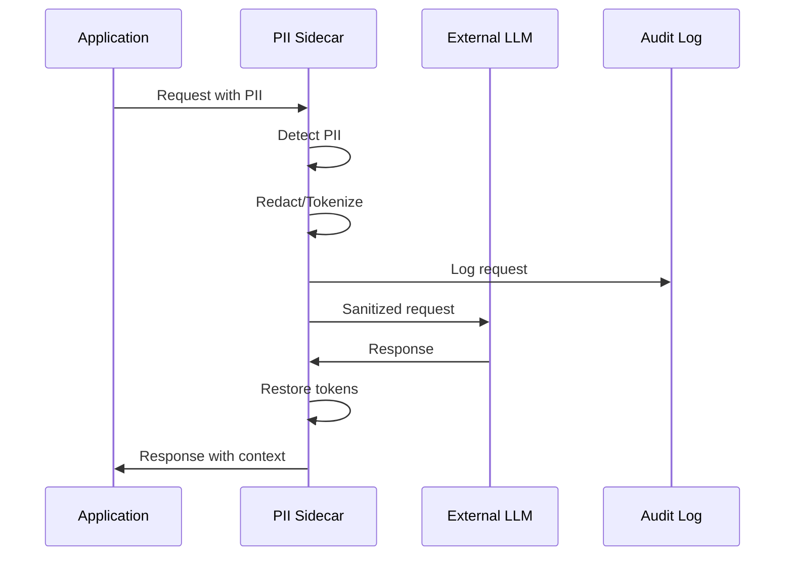

# Design Document / 设计文档

## Overview / 概述

本设计文档描述了Persons Finder应用的生产部署架构。该解决方案采用容器化、Kubernetes编排、自动化CI/CD流水线和安全最佳实践，实现可扩展、安全且可靠的生产环境部署。

This design document describes the production deployment architecture for the Persons Finder application. The solution employs containerization, Kubernetes orchestration, automated CI/CD pipelines, and security best practices to achieve a scalable, secure, and reliable production environment deployment.

### Application Overview / 应用概述

Persons Finder是一个Spring Boot REST API应用，用于管理人员位置信息并查找附近的人。应用采用清晰的三层架构：

Persons Finder is a Spring Boot REST API application for managing person location information and finding nearby people. The application follows a clean three-layer architecture:

**技术栈 / Technology Stack:**
- Kotlin 1.6.21
- Spring Boot 2.7.0
- Spring Web (REST API支持)
- Spring Data JPA (数据持久化)
- H2 Database 2.1.212 (内存数据库)
- Gradle (构建工具)
- JDK 11

**三层架构 / Three-Layer Architecture:**

1. **Presentation Layer (表现层)** - `presentation/`
   - REST API endpoints via PersonController
   - Request/Response handling
   - Input validation

2. **Domain Layer (领域层)** - `domain/services/`
   - Business logic
   - PersonsService and LocationsService
   - Location calculation algorithms

3. **Data Layer (数据层)** - `data/`
   - Person and Location entities
   - Database persistence via Spring Data JPA
   - H2 in-memory database

**计划的API端点 / Planned API Endpoints:**
- POST /api/v1/persons - 创建人员 / Create person
- PUT /api/v1/persons/{id}/location - 更新位置 / Update location
- GET /api/v1/persons/{id}/nearby?radius={km} - 查找附近的人 / Find nearby people
- GET /api/v1/persons?ids={ids} - 获取人员详情 / Get person details

核心设计原则 / Core Design Principles:
- 安全第一：密钥管理、非root容器、漏洞扫描 / Security First: Secret management, non-root containers, vulnerability scanning
- 可观测性：健康检查、探针、日志 / Observability: Health checks, probes, logging
- 可扩展性：HPA自动扩展、资源限制 / Scalability: HPA auto-scaling, resource limits
- 可重复性：IaC、版本控制、声明式配置 / Repeatability: IaC, version control, declarative configuration

### Application Data Models / 应用数据模型

**Person Entity / 人员实体:**
```kotlin
data class Person(
    val id: Long,        // Unique identifier / 唯一标识符
    val name: String     // Person's name / 人员姓名
)
```

**Location Entity / 位置实体:**
```kotlin
data class Location(
    val referenceId: Long,  // Person's ID / 人员 ID
    val latitude: Double,   // Latitude coordinate (-90 to 90) / 纬度坐标（-90 到 90）
    val longitude: Double   // Longitude coordinate (-180 to 180) / 经度坐标（-180 到 180）
)
```

## DevOps Code Structure / DevOps代码结构

所有DevOps相关代码统一组织在 `devops/` 目录下，遵循业界最佳实践，实现清晰的模块化和环境分离。

All DevOps-related code is organized under the `devops/` directory, following industry best practices for clear modularization and environment separation.

### Directory Structure / 目录结构

```
devops/
├── docker/                          # Docker容器化配置 / Docker containerization
│   ├── Dockerfile                   # 多阶段构建配置 / Multi-stage build configuration
│   └── .dockerignore               # Docker忽略文件 / Docker ignore file
│
├── helm/                            # Helm Charts / Helm图表
│   └── persons-finder/             # 应用Helm Chart / Application Helm Chart
│       ├── Chart.yaml              # Chart元数据 / Chart metadata
│       ├── values.yaml             # 默认配置 / Default configuration
│       ├── values-dev.yaml         # 开发环境配置 / Dev environment config
│       ├── values-prod.yaml        # 生产环境配置 / Prod environment config
│       ├── .helmignore             # Helm忽略文件 / Helm ignore file
│       ├── README.md               # Chart文档 / Chart documentation
│       ├── templates/              # Kubernetes资源模板 / K8s resource templates
│       │   ├── _helpers.tpl        # 模板辅助函数 / Template helpers
│       │   ├── NOTES.txt           # 安装后说明 / Post-install notes
│       │   ├── deployment.yaml     # Deployment模板 / Deployment template
│       │   ├── service.yaml        # Service模板 / Service template
│       │   ├── ingress.yaml        # Ingress模板 / Ingress template
│       │   ├── hpa.yaml            # HPA模板 / HPA template
│       │   ├── secret.yaml         # Secret模板 / Secret template
│       │   ├── serviceaccount.yaml # ServiceAccount模板 / ServiceAccount template
│       │   ├── rbac.yaml           # RBAC模板 / RBAC template
│       │   ├── networkpolicy.yaml  # NetworkPolicy模板 / NetworkPolicy template
│       │   └── imagepullsecret.yaml # ImagePullSecret模板 / ImagePullSecret template
│       └── charts/                 # Chart依赖 / Chart dependencies
│
├── terraform/                       # 基础设施即代码 / Infrastructure as Code
│   ├── backend.tf                  # Terraform后端配置 / Backend configuration
│   ├── versions.tf                 # 版本约束 / Version constraints
│   ├── variables.tf                # 全局变量 / Global variables
│   ├── outputs.tf                  # 全局输出 / Global outputs
│   ├── README.md                   # Terraform文档 / Terraform documentation
│   ├── modules/                    # 可重用模块 / Reusable modules
│   │   ├── iam/                    # IAM模块 / IAM module
│   │   │   ├── main.tf
│   │   │   ├── oidc.tf             # OIDC Provider配置 / OIDC Provider config
│   │   │   ├── roles.tf            # IAM角色定义 / IAM role definitions
│   │   │   ├── variables.tf
│   │   │   ├── outputs.tf
│   │   │   ├── policies/           # IAM策略文件 / IAM policy files
│   │   │   │   ├── ecr-push.json
│   │   │   │   ├── eks-access.json
│   │   │   │   └── deployer.json
│   │   │   └── trust-policies/     # 信任策略 / Trust policies
│   │   │       ├── github-oidc.json
│   │   │       └── eks-nodes.json
│   │   ├── vpc/                    # VPC模块 / VPC module
│   │   │   ├── main.tf
│   │   │   ├── security-groups.tf  # 安全组配置 / Security groups config
│   │   │   ├── variables.tf
│   │   │   └── outputs.tf
│   │   ├── eks/                    # EKS模块 / EKS module
│   │   │   ├── main.tf
│   │   │   ├── aws-auth.tf         # aws-auth ConfigMap / aws-auth ConfigMap
│   │   │   ├── variables.tf
│   │   │   └── outputs.tf
│   │   ├── ecr/                    # ECR模块 / ECR module
│   │   │   ├── main.tf
│   │   │   ├── variables.tf
│   │   │   └── outputs.tf
│   │   └── secrets-manager/        # Secrets Manager模块 / Secrets Manager module
│   │       ├── main.tf
│   │       ├── variables.tf
│   │       └── outputs.tf
│   └── environments/               # 环境配置 / Environment configurations
│       ├── dev/                    # 开发环境 / Development environment
│       │   ├── main.tf
│       │   └── terraform.tfvars
│       └── prod/                   # 生产环境 / Production environment
│           ├── main.tf
│           └── terraform.tfvars
│
├── scripts/                         # 部署脚本 / Deployment scripts
│   ├── deploy.sh                   # Helm部署脚本 / Helm deployment script
│   ├── verify.sh                   # 部署验证脚本 / Deployment verification
│   ├── local-test.sh               # 本地测试脚本 / Local testing script
│   ├── setup-eks.sh                # EKS设置脚本 / EKS setup script
│   ├── teardown-eks.sh             # EKS清理脚本 / EKS teardown script
│   └── setup-github-oidc.sh        # GitHub OIDC设置脚本 / GitHub OIDC setup script
│
├── ci/                              # CI/CD配置 / CI/CD configurations
│   └── ci-cd.yml                   # GitHub Actions工作流 / GitHub Actions workflow
│
└── docs/                            # 部署文档 / Deployment documentation
    ├── DEPLOYMENT.md               # 完整部署指南 / Complete deployment guide
    ├── QUICKSTART.md               # 快速开始指南 / Quick start guide
    ├── GITHUB-OIDC-SETUP.md        # GitHub OIDC配置指南 / GitHub OIDC setup guide
    └── SECRETS-MANAGEMENT.md       # 密钥管理指南 / Secrets management guide
```

### Design Principles / 设计原则

1. **集中管理 / Centralized Management:** 所有DevOps代码集中在 `devops/` 目录，便于维护和版本控制
2. **环境分离 / Environment Separation:** 通过不同的配置文件（values-dev.yaml, values-prod.yaml）和Terraform环境目录实现环境隔离
3. **模块化 / Modularization:** Terraform模块可重用，Helm模板参数化，提高代码复用性
4. **文档化 / Documentation:** 每个主要目录包含README.md，提供清晰的使用说明
5. **脚本自动化 / Script Automation:** 提供辅助脚本简化常见操作，降低人为错误

### File Mapping / 文件映射

部分文件需要从 `devops/` 目录复制到项目根目录的特定位置：

- `devops/docker/Dockerfile` → 项目根目录 `Dockerfile`
- `devops/ci/ci-cd.yml` → `.github/workflows/ci-cd.yml`

这种设计既保持了DevOps代码的集中管理，又满足了工具链对文件位置的要求。

## Architecture / 架构

### Authentication and Authorization Architecture / 认证和授权架构

生产部署涉及多个系统和服务的认证授权，采用最小权限原则和安全最佳实践。

Production deployment involves authentication and authorization across multiple systems and services, following the principle of least privilege and security best practices.

#### 1. AWS Authentication / AWS 认证

**IAM Roles and Policies / IAM 角色和策略**


**认证方式 / Authentication Methods:**

1. **GitHub Actions → AWS (OIDC)**
   - 使用 OpenID Connect (OIDC) 进行无密钥认证 / Use OpenID Connect (OIDC) for keyless authentication
   - 避免在 GitHub Secrets 中存储长期 AWS 凭证 / Avoid storing long-term AWS credentials in GitHub Secrets
   - 配置 IAM OIDC Identity Provider / Configure IAM OIDC Identity Provider
   - 创建信任策略限制访问范围 / Create trust policy to limit access scope

2. **Terraform → AWS**
   - 本地开发：使用 AWS CLI 配置的凭证 / Local development: Use AWS CLI configured credentials
   - CI/CD：使用 OIDC 假设的 IAM 角色 / CI/CD: Use IAM role assumed via OIDC
   - 状态文件存储在 S3，使用 DynamoDB 锁定 / State files stored in S3 with DynamoDB locking

3. **kubectl → EKS**
   - 使用 AWS IAM Authenticator / Use AWS IAM Authenticator
   - 通过 IAM 角色映射到 Kubernetes RBAC / Map IAM roles to Kubernetes RBAC
   - 配置 aws-auth ConfigMap / Configure aws-auth ConfigMap

**IAM 策略示例 / IAM Policy Examples:**

```json
{
  "Version": "2012-10-17",
  "Statement": [
    {
      "Effect": "Allow",
      "Action": [
        "ecr:GetAuthorizationToken",
        "ecr:BatchCheckLayerAvailability",
        "ecr:GetDownloadUrlForLayer",
        "ecr:PutImage",
        "ecr:InitiateLayerUpload",
        "ecr:UploadLayerPart",
        "ecr:CompleteLayerUpload"
      ],
      "Resource": "*"
    },
    {
      "Effect": "Allow",
      "Action": [
        "eks:DescribeCluster",
        "eks:ListClusters"
      ],
      "Resource": "*"
    }
  ]
}
```

**文件位置 / File Location:**
- IAM 策略定义：`devops/terraform/modules/iam/policies/`
- OIDC 配置：`devops/terraform/modules/iam/oidc.tf`
- 信任策略：`devops/terraform/modules/iam/trust-policies/`

#### 2. Kubernetes RBAC / Kubernetes 基于角色的访问控制

**RBAC 架构 / RBAC Architecture:**


**角色定义 / Role Definitions:**

1. **ClusterRole: cluster-admin**
   - 完全集群管理权限 / Full cluster management permissions
   - 仅限运维团队 / Operations team only

2. **ClusterRole: developer**
   - 命名空间级别的读写权限 / Namespace-level read/write permissions
   - 可以部署和管理应用 / Can deploy and manage applications
   - 不能修改集群级别资源 / Cannot modify cluster-level resources

3. **ClusterRole: deployer (CI/CD)**
   - 部署应用所需的最小权限 / Minimum permissions required for deployment
   - 创建/更新 Deployments, Services, ConfigMaps, Secrets
   - 读取 Pods, Events 用于验证 / Read Pods, Events for verification

4. **ServiceAccount: persons-finder**
   - 应用运行时使用的服务账号 / Service account used by application at runtime
   - 仅限访问应用所需的资源 / Limited to resources required by application
   - 读取 Secrets, ConfigMaps / Read Secrets, ConfigMaps

**文件位置 / File Location:**
- RBAC 定义：`devops/helm/persons-finder/templates/rbac.yaml`
- ServiceAccount：`devops/helm/persons-finder/templates/serviceaccount.yaml`
- aws-auth ConfigMap：`devops/terraform/modules/eks/aws-auth.tf`

#### 3. Container Registry Authentication / 容器镜像仓库认证

**Amazon ECR 认证 / Amazon ECR Authentication:**

1. **CI/CD Pipeline**
   - 使用 OIDC 获取临时凭证 / Use OIDC to obtain temporary credentials
   - 通过 `aws ecr get-login-password` 获取 Docker 登录令牌 / Get Docker login token via `aws ecr get-login-password`
   - 令牌有效期 12 小时 / Token valid for 12 hours

2. **Kubernetes Cluster**
   - 使用 ImagePullSecrets / Use ImagePullSecrets
   - 通过 IAM 角色自动刷新凭证 / Automatically refresh credentials via IAM roles
   - 配置 ECR credential helper / Configure ECR credential helper

**文件位置 / File Location:**
- ECR 仓库定义：`devops/terraform/modules/ecr/main.tf`
- ImagePullSecret 配置：`devops/helm/persons-finder/templates/imagepullsecret.yaml`

#### 4. Secrets Management / 密钥管理

**多层密钥管理策略 / Multi-layer Secrets Management Strategy:**


**密钥类型和存储 / Secret Types and Storage:**

1. **应用密钥 (Application Secrets)**
   - OpenAI API Key
   - 数据库密码 / Database passwords
   - 存储位置：AWS Secrets Manager / Storage: AWS Secrets Manager
   - 同步到 Kubernetes Secrets / Synced to Kubernetes Secrets

2. **基础设施密钥 (Infrastructure Secrets)**
   - AWS Access Keys (仅用于初始化，之后使用 OIDC) / AWS Access Keys (for initialization only, then use OIDC)
   - Terraform 状态加密密钥 / Terraform state encryption keys
   - 存储位置：GitHub Secrets (加密) / Storage: GitHub Secrets (encrypted)

3. **TLS 证书 (TLS Certificates)**
   - Ingress TLS 证书 / Ingress TLS certificates
   - 使用 cert-manager 自动管理 / Automatically managed by cert-manager
   - Let's Encrypt 或企业 CA / Let's Encrypt or enterprise CA

**最佳实践 / Best Practices:**

- ✅ 使用 External Secrets Operator 同步外部密钥 / Use External Secrets Operator to sync external secrets
- ✅ 启用密钥轮换 / Enable secret rotation
- ✅ 密钥加密存储 / Encrypt secrets at rest
- ✅ 审计密钥访问 / Audit secret access
- ✅ 最小权限原则 / Principle of least privilege
- ❌ 不在代码中硬编码密钥 / Never hardcode secrets in code
- ❌ 不在 Git 中提交密钥 / Never commit secrets to Git

**文件位置 / File Location:**
- Secrets Manager 配置：`devops/terraform/modules/secrets-manager/main.tf`
- External Secrets Operator：`devops/helm/external-secrets/` (可选)
- Secret 模板：`devops/helm/persons-finder/templates/secret.yaml`

#### 5. GitHub Actions Authentication / GitHub Actions 认证

**认证流程 / Authentication Flow:**

1. **Repository Secrets**
   - 存储敏感配置变量 / Store sensitive configuration variables
   - 加密存储，仅在运行时解密 / Encrypted at rest, decrypted at runtime
   - 需要配置的密钥：
     - `AWS_ACCOUNT_ID`: AWS 账号 ID
     - `AWS_REGION`: AWS 区域
     - `ECR_REPOSITORY`: ECR 仓库名称

2. **OIDC Token Exchange**
   - GitHub 生成 OIDC token / GitHub generates OIDC token
   - Token 包含仓库和工作流信息 / Token contains repository and workflow info
   - AWS 验证 token 并授予临时凭证 / AWS validates token and grants temporary credentials

3. **Environment Protection Rules**
   - 生产环境需要审批 / Production environment requires approval
   - 限制可以部署的分支 / Restrict branches that can deploy
   - 配置环境密钥 / Configure environment secrets

**文件位置 / File Location:**
- OIDC 配置文档：`devops/docs/GITHUB-OIDC-SETUP.md`
- CI/CD 工作流：`devops/ci/ci-cd.yml`

#### 6. Network Security / 网络安全

**网络隔离和访问控制 / Network Isolation and Access Control:**

1. **VPC 设计 / VPC Design**
   - 公有子网：负载均衡器 / Public subnets: Load balancers
   - 私有子网：应用 Pods / Private subnets: Application Pods
   - 数据库子网：数据存储 / Database subnets: Data storage

2. **Security Groups**
   - EKS 控制平面安全组 / EKS control plane security group
   - 节点安全组 / Node security group
   - Pod 安全组 (使用 Security Groups for Pods) / Pod security groups

3. **Network Policies**
   - 限制 Pod 间通信 / Restrict inter-pod communication
   - 仅允许必要的出站流量 / Allow only necessary egress traffic
   - 默认拒绝策略 / Default deny policy

**文件位置 / File Location:**
- Security Groups：`devops/terraform/modules/vpc/security-groups.tf`
- Network Policies：`devops/helm/persons-finder/templates/networkpolicy.yaml`

### High-Level Architecture / 高层架构


**架构说明 / Architecture Description:**

该架构展示了完整的DevOps生产部署流程：

1. **CI/CD流水线 (CI/CD Pipeline):** 代码从GitHub仓库推送后，通过GitHub Actions自动构建、测试、安全扫描，最终推送到容器注册表
2. **Kubernetes集群 (Kubernetes Cluster):** 
   - Deployment管理多个Pod副本（Pod 1, Pod 2, Pod N）
   - HPA（水平Pod自动扩展器）根据负载自动调整Pod数量
   - Service提供稳定的内部网络端点
   - Ingress处理外部流量路由
   - Secrets安全地注入API密钥到各个Pod
3. **PII脱敏边车 (PII Sidecar):** 每个应用Pod配备一个PII脱敏边车容器，拦截并清理发往外部LLM的请求
4. **外部服务 (External Services):** LLM提供商接收经过脱敏处理的请求
5. **用户访问 (Users):** 用户通过Ingress访问应用

### Container Architecture / 容器架构

应用将使用多阶段Docker构建打包，确保最小镜像大小和安全性。

The application will be packaged using multi-stage Docker builds to ensure minimal image size and security.

**构建阶段 / Build Stage:**
- 基础镜像：gradle:7.6-jdk11 / Base image: gradle:7.6-jdk11
- 编译Kotlin 1.6.21代码和依赖 / Compile Kotlin 1.6.21 code and dependencies
- 运行单元测试 / Run unit tests
- 生成可执行JAR (Spring Boot 2.7.0) / Generate executable JAR (Spring Boot 2.7.0)

**运行阶段 / Runtime Stage:**
- 基础镜像：eclipse-temurin:11-jre-alpine / Base image: eclipse-temurin:11-jre-alpine
- 仅复制必要的JAR文件 / Copy only necessary JAR files
- 创建非root用户运行应用 / Create non-root user to run application
- 暴露8080端口用于REST API / Expose port 8080 for REST API

**应用配置 / Application Configuration:**
- H2内存数据库配置在application.properties / H2 in-memory database configured in application.properties
- 数据库URL: jdbc:h2:mem:testdb
- JPA使用Hibernate方言 / JPA uses Hibernate dialect
- OPENAI_API_KEY通过环境变量注入 / OPENAI_API_KEY injected via environment variable
- 支持Spring profiles (default, dev, prod) / Supports Spring profiles (default, dev, prod)

### Kubernetes Deployment Architecture / Kubernetes部署架构

**Helm Chart结构 / Helm Chart Structure:**
- Chart.yaml：定义Chart元数据和版本 / Define Chart metadata and version
- values.yaml：默认配置值 / Default configuration values
- values-dev.yaml, values-prod.yaml：环境特定配置 / Environment-specific configurations
- templates/：Kubernetes资源模板 / Kubernetes resource templates

**Deployment配置 / Deployment Configuration:**
- 副本数：2（最小），由HPA管理 / Replicas: 2 (minimum), managed by HPA
- 滚动更新策略：maxSurge=1, maxUnavailable=0 / Rolling update strategy: maxSurge=1, maxUnavailable=0
- 资源请求：CPU 250m, Memory 512Mi / Resource requests: CPU 250m, Memory 512Mi
- 资源限制：CPU 1000m, Memory 1Gi / Resource limits: CPU 1000m, Memory 1Gi
- 通过values.yaml参数化配置 / Parameterized via values.yaml

**探针配置 / Probe Configuration:**
- 就绪探针：HTTP GET /actuator/health，初始延迟30s，周期10s / Readiness probe: HTTP GET /actuator/health, initial delay 30s, period 10s
- 存活探针：HTTP GET /actuator/health，初始延迟60s，周期15s / Liveness probe: HTTP GET /actuator/health, initial delay 60s, period 15s
- 探针参数可通过values.yaml配置 / Probe parameters configurable via values.yaml

**Service配置 / Service Configuration:**
- 类型：ClusterIP / Type: ClusterIP
- 端口：80 -> 8080 / Port: 80 -> 8080
- 选择器：app=persons-finder / Selector: app=persons-finder
- 服务类型可通过values.yaml切换 / Service type switchable via values.yaml

**Ingress配置 / Ingress Configuration:**
- 路径：/ / Path: /
- 后端服务：persons-finder-service:80 / Backend service: persons-finder-service:80
- TLS支持（可选） / TLS support (optional)
- 主机名和TLS通过values.yaml配置 / Hostname and TLS configured via values.yaml

**HPA配置 / HPA Configuration:**
- 最小副本：2 / Min replicas: 2
- 最大副本：10 / Max replicas: 10
- 目标CPU利用率：70% / Target CPU utilization: 70%
- 扩展策略：稳定窗口300s / Scale policy: stabilization window 300s
- HPA参数可通过values.yaml调整 / HPA parameters adjustable via values.yaml

### Secret Management Architecture / 密钥管理架构

**Kubernetes Secrets:**
```yaml
apiVersion: v1
kind: Secret
metadata:
  name: persons-finder-secrets
type: Opaque
data:
  OPENAI_API_KEY: <base64-encoded-key>
```

**环境变量注入 / Environment Variable Injection:**
- Deployment通过envFrom引用Secret / Deployment references Secret via envFrom
- 应用在运行时读取环境变量 / Application reads environment variables at runtime
- Secret与应用部署分离管理 / Secret managed separately from application deployment

### PII Protection Architecture / PII保护架构

**Sidecar模式 / Sidecar Pattern:**

每个应用Pod包含两个容器：
Each application Pod contains two containers:

1. **主应用容器 / Main Application Container:**
   - Persons Finder应用 / Persons Finder application
   - 处理业务逻辑 / Handles business logic
   - 通过localhost与sidecar通信 / Communicates with sidecar via localhost

2. **PII脱敏Sidecar容器 / PII Redaction Sidecar Container:**
   - 拦截所有出站LLM请求 / Intercepts all outbound LLM requests
   - 检测和脱敏PII（姓名、位置等） / Detects and redacts PII (names, locations, etc.)
   - 维护审计日志 / Maintains audit logs
   - 转发清理后的请求到外部LLM / Forwards sanitized requests to external LLM

**PII脱敏流程 / PII Redaction Flow:**



**流程说明 / Flow Description:**

该时序图展示了PII脱敏的完整处理流程：

1. **应用发送请求 (Application → PII Sidecar):** 应用发送包含PII（个人身份信息）的请求到边车容器
2. **检测PII (Detect PII):** 边车容器使用正则表达式和NER（命名实体识别）检测请求中的敏感信息
3. **脱敏/标记化 (Redact/Tokenize):** 将检测到的PII进行脱敏或替换为可逆的标记
4. **记录审计日志 (Log request):** 将请求元数据、检测到的PII类型和时间戳记录到审计日志
5. **发送清理后的请求 (Sanitized request):** 将脱敏后的请求转发到外部LLM提供商
6. **接收响应 (Response):** 从LLM接收响应
7. **恢复标记 (Restore tokens):** 将响应中的标记恢复为原始上下文
8. **返回应用 (Response with context):** 将带有原始上下文的响应返回给应用

这种设计确保了敏感信息不会泄露到外部服务，同时保持了应用的正常功能。

**PII检测策略 / PII Detection Strategy:**
- 正则表达式匹配姓名模式 / Regex matching for name patterns
- NER（命名实体识别）用于人名 / NER (Named Entity Recognition) for person names
- 地理坐标脱敏 / Geographic coordinate redaction
- 可配置的脱敏规则 / Configurable redaction rules

**替代方案：API Gateway模式 / Alternative: API Gateway Pattern:**
- 集中式网关处理所有出站流量 / Centralized gateway handles all egress traffic
- 更容易管理和更新规则 / Easier to manage and update rules
- 单点故障风险 / Single point of failure risk
- 适合多服务环境 / Suitable for multi-service environments

## Components and Interfaces / 组件和接口

### 1. Dockerfile

**文件位置 / File Location:** `devops/docker/Dockerfile` (复制到项目根目录 / Copy to project root)

**职责 / Responsibilities:**
- 构建应用的可执行JAR / Build executable JAR of the application
- 创建最小化的运行时镜像 / Create minimized runtime image
- 配置非root用户 / Configure non-root user
- 设置健康检查 / Set up health checks

**接口 / Interfaces:**
- 输入：源代码、build.gradle.kts / Input: Source code, build.gradle.kts
- 输出：Docker镜像 / Output: Docker image
- 暴露端口：8080 / Exposed port: 8080

### 2. Helm Chart / Helm Chart

**文件位置 / File Location:** `devops/helm/persons-finder/`

**2.1 Chart.yaml**

**文件位置 / File Location:** `devops/helm/persons-finder/Chart.yaml`

**职责 / Responsibilities:**
- 定义Chart元数据（名称、版本、描述） / Define Chart metadata (name, version, description)
- 声明Chart依赖（如需要） / Declare Chart dependencies (if needed)
- 指定API版本和应用版本 / Specify API version and app version

**接口 / Interfaces:**
- name: persons-finder
- version: Chart版本（语义化版本） / Chart version (semantic versioning)
- appVersion: 应用版本 / Application version

**2.2 values.yaml**

**文件位置 / File Location:** `devops/helm/persons-finder/values.yaml`

**职责 / Responsibilities:**
- 定义所有可配置参数的默认值 / Define default values for all configurable parameters
- 提供镜像仓库、标签、副本数等配置 / Provide configuration for image repository, tag, replica count, etc.
- 定义资源限制和请求 / Define resource limits and requests
- 配置探针参数 / Configure probe parameters

**接口 / Interfaces:**
- image.repository, image.tag, image.pullPolicy
- replicaCount, resources, autoscaling
- service.type, service.port
- ingress.enabled, ingress.hosts, ingress.tls
- probes.liveness, probes.readiness

**2.3 Deployment Template (templates/deployment.yaml)**

**文件位置 / File Location:** `devops/helm/persons-finder/templates/deployment.yaml`

**职责 / Responsibilities:**
- 定义Pod模板和副本数 / Define Pod template and replica count
- 配置资源限制和请求 / Configure resource limits and requests
- 设置健康探针 / Set up health probes
- 注入环境变量和Secrets / Inject environment variables and Secrets

**接口 / Interfaces:**
- 标签选择器：app=persons-finder / Label selector: app=persons-finder
- 容器端口：8080 / Container port: 8080
- 环境变量：OPENAI_API_KEY（来自Secret） / Environment variable: OPENAI_API_KEY (from Secret)

**2.4 Service Template (templates/service.yaml)**

**文件位置 / File Location:** `devops/helm/persons-finder/templates/service.yaml`

**职责 / Responsibilities:**
- 为Deployment提供稳定的网络端点 / Provide stable network endpoint for Deployment
- 负载均衡到多个Pod / Load balance across multiple Pods

**接口 / Interfaces:**
- 类型：ClusterIP / Type: ClusterIP
- 端口映射：80:8080 / Port mapping: 80:8080
- 选择器：app=persons-finder / Selector: app=persons-finder

**2.5 Ingress Template (templates/ingress.yaml)**

**文件位置 / File Location:** `devops/helm/persons-finder/templates/ingress.yaml`

**职责 / Responsibilities:**
- 提供外部HTTP/HTTPS访问 / Provide external HTTP/HTTPS access
- 路由流量到Service / Route traffic to Service
- 可选TLS终止 / Optional TLS termination

**接口 / Interfaces:**
- 主机：persons-finder.example.com（可配置） / Host: persons-finder.example.com (configurable)
- 路径：/ / Path: /
- 后端：persons-finder-service:80 / Backend: persons-finder-service:80

**2.6 HPA Template (templates/hpa.yaml)**

**文件位置 / File Location:** `devops/helm/persons-finder/templates/hpa.yaml`

**职责 / Responsibilities:**
- 监控Pod CPU利用率 / Monitor Pod CPU utilization
- 自动调整副本数 / Automatically adjust replica count
- 维持性能和成本平衡 / Maintain performance and cost balance

**接口 / Interfaces:**
- 目标：Deployment/persons-finder / Target: Deployment/persons-finder
- 指标：CPU利用率70% / Metric: CPU utilization 70%
- 范围：2-10副本 / Range: 2-10 replicas

**2.7 Secret Template (templates/secret.yaml)**

**文件位置 / File Location:** `devops/helm/persons-finder/templates/secret.yaml`

**职责 / Responsibilities:**
- 存储敏感配置数据 / Store sensitive configuration data
- 提供API密钥给应用 / Provide API key to application

**接口 / Interfaces:**
- 键：OPENAI_API_KEY / Key: OPENAI_API_KEY
- 值：base64编码的API密钥 / Value: base64-encoded API key

### 3. CI/CD Pipeline / CI/CD流水线

**文件位置 / File Location:** `devops/ci/ci-cd.yml` (复制到 `.github/workflows/ci-cd.yml` / Copy to `.github/workflows/ci-cd.yml`)

**3.1 GitHub Actions Workflow (.github/workflows/ci-cd.yml)**

**职责 / Responsibilities:**
- 自动化构建、测试和部署流程 / Automate build, test, and deployment process
- 执行安全扫描 / Execute security scanning
- 推送镜像到注册表 / Push images to registry

**阶段 / Stages:**

1. **Checkout / 检出代码**
   - 克隆仓库代码 / Clone repository code

2. **Build / 构建**
   - 使用Gradle构建应用 / Build application using Gradle
   - 运行单元测试 / Run unit tests
   - 生成JAR文件 / Generate JAR file

3. **Docker Build / Docker构建**
   - 构建Docker镜像 / Build Docker image
   - 标记镜像版本 / Tag image version

4. **Security Scan / 安全扫描**
   - 使用Trivy扫描镜像漏洞 / Scan image vulnerabilities using Trivy
   - 检查依赖安全问题 / Check dependency security issues
   - 如果发现严重漏洞则失败 / Fail if critical vulnerabilities found

5. **Push / 推送**
   - 推送镜像到容器注册表 / Push image to container registry
   - 标记latest和版本标签 / Tag with latest and version tags

**接口 / Interfaces:**
- 触发器：push到main分支 / Trigger: push to main branch
- 输出：Docker镜像在注册表 / Output: Docker image in registry
- 通知：构建状态 / Notification: Build status

### 4. PII Redaction Sidecar / PII脱敏边车

**文件位置 / File Location:** 
- Sidecar实现代码：`src/main/kotlin/com/persons/finder/pii/` (应用代码目录)
- Sidecar容器配置：集成在 `devops/helm/persons-finder/templates/deployment.yaml` 中

**职责 / Responsibilities:**
- 拦截应用到LLM的HTTP请求 / Intercept HTTP requests from app to LLM
- 检测请求中的PII / Detect PII in requests
- 脱敏或标记化敏感数据 / Redact or tokenize sensitive data
- 记录审计日志 / Log audit trail
- 转发清理后的请求 / Forward sanitized requests

**接口 / Interfaces:**
- 输入：来自应用的HTTP请求 / Input: HTTP requests from application
- 输出：清理后的HTTP请求到LLM / Output: Sanitized HTTP requests to LLM
- 配置：脱敏规则、PII模式 / Configuration: Redaction rules, PII patterns
- 日志：审计日志到stdout / Logs: Audit logs to stdout

### 5. IAM and Authentication Module / IAM 和认证模块

**文件位置 / File Location:** `devops/terraform/modules/iam/`

**5.1 OIDC Identity Provider**

**文件位置 / File Location:** `devops/terraform/modules/iam/oidc.tf`

**职责 / Responsibilities:**
- 创建 GitHub OIDC Identity Provider / Create GitHub OIDC Identity Provider
- 配置信任关系 / Configure trust relationships
- 限制可以假设角色的仓库和分支 / Restrict repositories and branches that can assume roles

**接口 / Interfaces:**
- 输入：GitHub 组织/仓库、允许的分支 / Input: GitHub org/repo, allowed branches
- 输出：OIDC Provider ARN / Output: OIDC Provider ARN

**5.2 IAM Roles and Policies**

**文件位置 / File Location:** `devops/terraform/modules/iam/roles.tf`

**职责 / Responsibilities:**
- 创建 GitHub Actions 使用的 IAM 角色 / Create IAM roles for GitHub Actions
- 附加最小权限策略 / Attach least-privilege policies
- 配置 ECR 推送权限 / Configure ECR push permissions
- 配置 EKS 访问权限 / Configure EKS access permissions

**接口 / Interfaces:**
- 输入：角色名称、策略 ARN / Input: Role name, policy ARNs
- 输出：角色 ARN、角色名称 / Output: Role ARN, role name

**5.3 EKS RBAC Configuration**

**文件位置 / File Location:** `devops/terraform/modules/eks/aws-auth.tf`

**职责 / Responsibilities:**
- 配置 aws-auth ConfigMap / Configure aws-auth ConfigMap
- 映射 IAM 角色到 Kubernetes 用户/组 / Map IAM roles to Kubernetes users/groups
- 设置管理员和开发者访问权限 / Set up admin and developer access

**接口 / Interfaces:**
- 输入：IAM 角色 ARN、Kubernetes 组 / Input: IAM role ARNs, Kubernetes groups
- 输出：ConfigMap 配置 / Output: ConfigMap configuration

### 6. Terraform Infrastructure / Terraform基础设施

**文件位置 / File Location:** `devops/terraform/`

**6.1 Backend Configuration**

**文件位置 / File Location:** `devops/terraform/backend.tf`

**职责 / Responsibilities:**
- 配置Terraform状态存储后端（S3 + DynamoDB） / Configure Terraform state storage backend (S3 + DynamoDB)
- 启用状态锁定防止并发修改 / Enable state locking to prevent concurrent modifications
- 配置状态加密 / Configure state encryption

**6.2 VPC Module**

**文件位置 / File Location:** `devops/terraform/modules/vpc/`

**职责 / Responsibilities:**
- 创建VPC和子网（公有/私有） / Create VPC and subnets (public/private)
- 配置NAT网关和Internet网关 / Configure NAT gateways and Internet gateway
- 设置路由表和安全组 / Set up route tables and security groups
- 跨多个可用区部署 / Deploy across multiple availability zones

**接口 / Interfaces:**
- 输入：VPC CIDR、子网CIDR、可用区列表 / Input: VPC CIDR, subnet CIDRs, AZ list
- 输出：VPC ID、子网ID、安全组ID / Output: VPC ID, subnet IDs, security group IDs

**6.3 EKS Module**

**文件位置 / File Location:** `devops/terraform/modules/eks/`

**职责 / Responsibilities:**
- 创建EKS集群和控制平面 / Create EKS cluster and control plane
- 配置托管节点组 / Configure managed node groups
- 设置IAM角色和策略 / Set up IAM roles and policies
- 配置集群附加组件（VPC CNI, CoreDNS, kube-proxy） / Configure cluster add-ons (VPC CNI, CoreDNS, kube-proxy)
- 启用集群日志记录 / Enable cluster logging

**接口 / Interfaces:**
- 输入：集群名称、Kubernetes版本、节点实例类型、节点数量 / Input: Cluster name, K8s version, node instance type, node count
- 输出：集群端点、集群证书、kubeconfig / Output: Cluster endpoint, cluster certificate, kubeconfig

**6.4 ECR Module**

**文件位置 / File Location:** `devops/terraform/modules/ecr/`

**职责 / Responsibilities:**
- 创建 Amazon ECR 仓库 / Create Amazon ECR repository
- 配置镜像扫描 / Configure image scanning
- 设置生命周期策略 / Set up lifecycle policies
- 配置访问权限 / Configure access permissions

**接口 / Interfaces:**
- 输入：仓库名称、扫描配置 / Input: Repository name, scan configuration
- 输出：仓库 URL、仓库 ARN / Output: Repository URL, repository ARN

**6.5 Secrets Manager Module**

**文件位置 / File Location:** `devops/terraform/modules/secrets-manager/`

**职责 / Responsibilities:**
- 创建 AWS Secrets Manager 密钥 / Create AWS Secrets Manager secrets
- 配置密钥轮换 / Configure secret rotation
- 设置访问策略 / Set up access policies
- 启用密钥加密 / Enable secret encryption

**接口 / Interfaces:**
- 输入：密钥名称、密钥值、轮换配置 / Input: Secret name, secret value, rotation config
- 输出：密钥 ARN / Output: Secret ARN

**6.6 Environment Configurations**

**文件位置 / File Location:** 
- 开发环境：`devops/terraform/environments/dev/`
- 生产环境：`devops/terraform/environments/prod/`

**职责 / Responsibilities:**
- 定义环境特定的变量值 / Define environment-specific variable values
- 组合VPC和EKS模块 / Compose VPC and EKS modules
- 配置环境特定的资源大小和数量 / Configure environment-specific resource sizes and counts

**接口 / Interfaces:**
- 输入：terraform.tfvars文件 / Input: terraform.tfvars file
- 输出：完整的AWS基础设施 / Output: Complete AWS infrastructure

### 7. Deployment Scripts / 部署脚本

**文件位置 / File Location:** `devops/scripts/`

**7.1 deploy.sh**

**文件位置 / File Location:** `devops/scripts/deploy.sh`

**职责 / Responsibilities:**
- 自动化Helm部署流程 / Automate Helm deployment process
- 支持多环境部署（dev/prod） / Support multi-environment deployment (dev/prod)
- 验证前置条件（kubectl, helm） / Verify prerequisites (kubectl, helm)
- 提供部署状态反馈 / Provide deployment status feedback

**7.2 verify.sh**

**文件位置 / File Location:** `devops/scripts/verify.sh`

**职责 / Responsibilities:**
- 验证部署状态 / Verify deployment status
- 检查Pod健康状态 / Check Pod health status
- 验证Service和Ingress配置 / Verify Service and Ingress configuration
- 运行基本的冒烟测试 / Run basic smoke tests

**7.3 local-test.sh**

**文件位置 / File Location:** `devops/scripts/local-test.sh`

**职责 / Responsibilities:**
- 创建本地Kind集群 / Create local Kind cluster
- 加载Docker镜像到Kind / Load Docker image into Kind
- 使用Helm部署应用 / Deploy application using Helm
- 配置端口转发进行测试 / Configure port forwarding for testing

**7.4 setup-eks.sh**

**文件位置 / File Location:** `devops/scripts/setup-eks.sh`

**职责 / Responsibilities:**
- 使用Terraform创建EKS集群 / Create EKS cluster using Terraform
- 配置kubectl上下文 / Configure kubectl context
- 安装必要的集群组件 / Install necessary cluster components
- 验证集群就绪状态 / Verify cluster readiness

**7.5 teardown-eks.sh**

**文件位置 / File Location:** `devops/scripts/teardown-eks.sh`

**职责 / Responsibilities:**
- 清理Helm部署 / Clean up Helm deployments
- 销毁Terraform管理的资源 / Destroy Terraform-managed resources
- 确认资源完全删除 / Confirm complete resource deletion

### 8. Documentation / 文档

**文件位置 / File Location:** `devops/docs/`

**8.1 DEPLOYMENT.md**

**文件位置 / File Location:** `devops/docs/DEPLOYMENT.md`

**内容 / Content:**
- 完整的部署指南 / Complete deployment guide
- 前置条件和工具安装 / Prerequisites and tool installation
- 本地部署步骤 / Local deployment steps
- AWS EKS部署步骤 / AWS EKS deployment steps
- 配置说明 / Configuration instructions
- 故障排查 / Troubleshooting

**8.2 QUICKSTART.md**

**文件位置 / File Location:** `devops/docs/QUICKSTART.md`

**内容 / Content:**
- 快速开始指南 / Quick start guide
- 最快路径到本地部署 / Fastest path to local deployment
- 最快路径到AWS部署 / Fastest path to AWS deployment
- 常见问题解答 / Common issues FAQ

**8.3 GITHUB-OIDC-SETUP.md**

**文件位置 / File Location:** `devops/docs/GITHUB-OIDC-SETUP.md`

**内容 / Content:**
- GitHub OIDC 配置步骤 / GitHub OIDC configuration steps
- AWS IAM 设置指南 / AWS IAM setup guide
- 信任策略配置 / Trust policy configuration
- 故障排查 / Troubleshooting

**8.4 SECRETS-MANAGEMENT.md**

**文件位置 / File Location:** `devops/docs/SECRETS-MANAGEMENT.md`

**内容 / Content:**
- 密钥管理最佳实践 / Secrets management best practices
- AWS Secrets Manager 使用指南 / AWS Secrets Manager usage guide
- Kubernetes Secrets 配置 / Kubernetes Secrets configuration
- 密钥轮换流程 / Secret rotation procedures

### Kubernetes Resource Models / Kubernetes资源模型

**Deployment Spec:**
```yaml
replicas: 2
selector:
  matchLabels:
    app: persons-finder
template:
  metadata:
    labels:
      app: persons-finder
  spec:
    containers:
    - name: persons-finder
      image: persons-finder:latest
      ports:
      - containerPort: 8080
      resources:
        requests:
          cpu: 250m
          memory: 512Mi
        limits:
          cpu: 1000m
          memory: 1Gi
      env:
      - name: OPENAI_API_KEY
        valueFrom:
          secretKeyRef:
            name: persons-finder-secrets
            key: OPENAI_API_KEY
      livenessProbe:
        httpGet:
          path: /actuator/health
          port: 8080
        initialDelaySeconds: 60
        periodSeconds: 15
      readinessProbe:
        httpGet:
          path: /actuator/health
          port: 8080
        initialDelaySeconds: 30
        periodSeconds: 10
```

**HPA Spec:**
```yaml
minReplicas: 2
maxReplicas: 10
metrics:
- type: Resource
  resource:
    name: cpu
    target:
      type: Utilization
      averageUtilization: 70
behavior:
  scaleDown:
    stabilizationWindowSeconds: 300
  scaleUp:
    stabilizationWindowSeconds: 0
```

### PII Redaction Models / PII脱敏模型

**Redaction Rule:**
```json
{
  "type": "person_name",
  "pattern": "regex_or_ner",
  "action": "redact|tokenize",
  "replacement": "[REDACTED]|<TOKEN>"
}
```

**Audit Log Entry:**
```json
{
  "timestamp": "2024-01-01T12:00:00Z",
  "request_id": "uuid",
  "pii_detected": ["name", "location"],
  "redactions_applied": 2,
  "destination": "llm_provider_url"
}
```


## Correctness Properties / 正确性属性

正确性属性是关于系统应该满足的特征或行为的形式化陈述，这些特征应该在所有有效执行中保持为真。属性作为人类可读规范和机器可验证正确性保证之间的桥梁。

A property is a characteristic or behavior that should hold true across all valid executions of a system - essentially, a formal statement about what the system should do. Properties serve as the bridge between human-readable specifications and machine-verifiable correctness guarantees.

基于需求分析，本系统的大部分验收标准是关于配置文件、资源定义和文档的存在性检查，这些更适合作为具体示例测试。以下是识别出的需要属性测试的通用正确性属性：

Based on requirements analysis, most acceptance criteria for this system are about the existence of configuration files, resource definitions, and documentation, which are better suited as concrete example tests. The following are the identified universal correctness properties that require property-based testing:

### Property 1: PII脱敏完整性 / PII Redaction Completeness

**属性描述 / Property Description:**

*对于任何*包含PII（个人身份信息）的出站请求，系统应在发送到外部LLM服务之前完全脱敏或标记化所有敏感信息。

*For any* outbound request containing PII (Personally Identifiable Information), the system SHALL completely redact or tokenize all sensitive information before sending to external LLM services.

**验证 / Validates:** Requirements 5.3

**测试策略 / Testing Strategy:**
- 生成包含各种PII类型的随机请求（姓名、位置坐标、电话号码等）
- Generate random requests containing various PII types (names, location coordinates, phone numbers, etc.)
- 通过PII脱敏组件处理请求
- Process requests through PII redaction component
- 验证输出请求不包含任何原始PII数据
- Verify output requests contain no original PII data
- 确保脱敏是可逆的（用于响应处理）
- Ensure redaction is reversible (for response processing)

### Property 2: 审计日志完整性 / Audit Log Completeness

**属性描述 / Property Description:**

*对于任何*到外部LLM提供商的API调用，系统应创建包含请求元数据、检测到的PII类型和时间戳的审计日志条目。

*For any* API call to external LLM providers, the system SHALL create an audit log entry containing request metadata, detected PII types, and timestamp.

**验证 / Validates:** Requirements 5.5

**测试策略 / Testing Strategy:**
- 生成随机的外部API调用序列
- Generate random sequences of external API calls
- 验证每个调用都有对应的审计日志条目
- Verify each call has a corresponding audit log entry
- 检查日志条目包含所有必需字段
- Check log entries contain all required fields
- 确保日志条目按时间顺序排列
- Ensure log entries are in chronological order

### Property 3: 容器镜像确定性 / Container Image Determinism

**属性描述 / Property Description:**

*对于任何*给定的源代码版本和构建配置，Docker构建过程应产生具有相同内容哈希的镜像（排除时间戳）。

*For any* given source code version and build configuration, the Docker build process SHALL produce an image with the same content hash (excluding timestamps).

**验证 / Validates:** Requirements 1.1, 1.2

**测试策略 / Testing Strategy:**
- 使用相同的源代码多次构建镜像
- Build image multiple times with identical source code
- 比较镜像层的内容哈希
- Compare content hashes of image layers
- 验证可重现的构建
- Verify reproducible builds
- 排除已知的非确定性元素（时间戳、随机ID）
- Exclude known non-deterministic elements (timestamps, random IDs)

## Error Handling / 错误处理

### 1. 容器启动失败 / Container Startup Failures

**场景 / Scenario:** 应用容器无法启动

**处理策略 / Handling Strategy:**
- Kubernetes自动重启失败的容器（通过restartPolicy: Always）
- Kubernetes automatically restarts failed containers (via restartPolicy: Always)
- 存活探针检测到失败后触发重启
- Liveness probe triggers restart after detecting failure
- 记录启动失败原因到容器日志
- Log startup failure reasons to container logs
- 如果持续失败，进入CrashLoopBackOff状态
- Enter CrashLoopBackOff state if failures persist

### 2. 缺失API密钥 / Missing API Key

**场景 / Scenario:** OPENAI_API_KEY环境变量未设置

**处理策略 / Handling Strategy:**
- 应用启动时检查必需的环境变量
- Application checks required environment variables at startup
- 如果缺失，记录清晰的错误消息并退出
- If missing, log clear error message and exit
- 错误消息格式："FATAL: Required environment variable OPENAI_API_KEY is not set"
- Error message format: "FATAL: Required environment variable OPENAI_API_KEY is not set"
- 退出码：1（非零表示失败）
- Exit code: 1 (non-zero indicates failure)

### 3. 健康检查失败 / Health Check Failures

**场景 / Scenario:** /actuator/health端点返回非200状态

**处理策略 / Handling Strategy:**
- 就绪探针失败：Pod从Service端点列表中移除，不接收流量
- Readiness probe failure: Pod removed from Service endpoints, receives no traffic
- 存活探针失败：Kubernetes重启容器
- Liveness probe failure: Kubernetes restarts container
- 应用记录健康检查失败的具体原因
- Application logs specific reason for health check failure
- 监控系统应告警持续的健康检查失败
- Monitoring system should alert on persistent health check failures

### 4. 资源耗尽 / Resource Exhaustion

**场景 / Scenario:** Pod达到CPU或内存限制

**处理策略 / Handling Strategy:**
- CPU限制：进程被节流，响应变慢
- CPU limit: Process is throttled, responses slow down
- 内存限制：Pod被OOMKilled（内存不足终止）
- Memory limit: Pod is OOMKilled (Out Of Memory Killed)
- HPA检测到高CPU使用率并扩展更多Pod
- HPA detects high CPU usage and scales up more Pods
- 监控系统告警资源使用率高
- Monitoring system alerts on high resource usage
- 考虑调整资源限制或优化应用
- Consider adjusting resource limits or optimizing application

### 5. PII脱敏失败 / PII Redaction Failures

**场景 / Scenario:** PII脱敏组件无法处理请求

**处理策略 / Handling Strategy:**
- 默认拒绝：如果脱敏失败，不发送请求到外部LLM
- Fail closed: If redaction fails, do not send request to external LLM
- 返回错误给调用者，包含安全的错误消息
- Return error to caller with safe error message
- 记录详细错误到审计日志
- Log detailed error to audit log
- 告警PII脱敏失败事件
- Alert on PII redaction failure events
- 不在错误消息中泄露PII
- Do not leak PII in error messages

### 6. CI/CD流水线失败 / CI/CD Pipeline Failures

**场景 / Scenario:** 构建、测试或安全扫描失败

**处理策略 / Handling Strategy:**
- 立即停止流水线执行
- Immediately stop pipeline execution
- 通知开发团队（GitHub通知、Slack等）
- Notify development team (GitHub notifications, Slack, etc.)
- 提供清晰的失败原因和日志链接
- Provide clear failure reason and log links
- 阻止有问题的代码部署到生产环境
- Prevent problematic code from deploying to production
- 保留上一个成功的镜像版本
- Retain last successful image version

### 7. HPA扩展失败 / HPA Scaling Failures

**场景 / Scenario:** HPA无法扩展Pod数量

**处理策略 / Handling Strategy:**
- 检查集群资源是否充足
- Check if cluster has sufficient resources
- 验证metrics-server是否正常运行
- Verify metrics-server is running properly
- 记录扩展失败事件
- Log scaling failure events
- 告警HPA扩展问题
- Alert on HPA scaling issues
- 现有Pod继续处理流量（可能过载）
- Existing Pods continue handling traffic (may be overloaded)

## Testing Strategy / 测试策略

### 双重测试方法 / Dual Testing Approach

本项目采用单元测试和属性测试相结合的方法，以实现全面的测试覆盖。

This project employs a combination of unit tests and property-based tests to achieve comprehensive test coverage.

**单元测试 / Unit Tests:**
- 验证特定示例和边缘情况
- Verify specific examples and edge cases
- 测试配置文件的存在性和正确性
- Test existence and correctness of configuration files
- 验证Kubernetes资源定义
- Verify Kubernetes resource definitions
- 检查Dockerfile最佳实践
- Check Dockerfile best practices
- 验证CI/CD工作流配置
- Verify CI/CD workflow configuration

**属性测试 / Property-Based Tests:**
- 验证跨所有输入的通用属性
- Verify universal properties across all inputs
- 通过随机化实现全面的输入覆盖
- Achieve comprehensive input coverage through randomization
- 测试PII脱敏的正确性
- Test correctness of PII redaction
- 验证审计日志的完整性
- Verify completeness of audit logs
- 确保容器构建的确定性
- Ensure determinism of container builds

### 测试工具和框架 / Testing Tools and Frameworks

**单元测试 / Unit Tests:**
- JUnit 5用于Kotlin/Java测试
- JUnit 5 for Kotlin/Java tests
- YAML验证工具（yamllint, kubeval）
- YAML validation tools (yamllint, kubeval)
- Dockerfile linter（hadolint）
- Dockerfile linter (hadolint)
- Shell脚本测试（bats）
- Shell script testing (bats)

**属性测试 / Property-Based Tests:**
- Kotest Property Testing（Kotlin）
- Kotest Property Testing (Kotlin)
- 最小100次迭代每个属性测试
- Minimum 100 iterations per property test
- 每个测试标记格式：**Feature: devops-production-deployment, Property {number}: {property_text}**
- Each test tag format: **Feature: devops-production-deployment, Property {number}: {property_text}**

**集成测试 / Integration Tests:**
- Docker Compose用于本地集成测试
- Docker Compose for local integration tests
- Kind（Kubernetes in Docker）用于K8s测试
- Kind (Kubernetes in Docker) for K8s testing
- Testcontainers用于容器化测试
- Testcontainers for containerized testing

**安全测试 / Security Tests:**
- Trivy用于容器镜像扫描
- Trivy for container image scanning
- Snyk用于依赖扫描
- Snyk for dependency scanning
- OWASP Dependency-Check
- OWASP Dependency-Check

### 测试配置 / Test Configuration

**属性测试配置 / Property Test Configuration:**
```kotlin
// Example property test configuration
class PIIRedactionPropertyTest : StringSpec({
    "Feature: devops-production-deployment, Property 1: PII Redaction Completeness" {
        checkAll(100, Arb.piiRequest()) { request ->
            val redacted = piiRedactor.redact(request)
            redacted.shouldNotContainPII()
            redacted.shouldBeReversible()
        }
    }
})
```

**单元测试示例 / Unit Test Examples:**
```kotlin
class DockerfileTest {
    @Test
    fun `Dockerfile should use multi-stage build`() {
        val dockerfile = File("Dockerfile").readText()
        val fromStatements = dockerfile.lines()
            .filter { it.trim().startsWith("FROM") }
        fromStatements.size shouldBeGreaterThan 1
    }
    
    @Test
    fun `Dockerfile should specify non-root user`() {
        val dockerfile = File("Dockerfile").readText()
        dockerfile shouldContain "USER"
        dockerfile shouldNotContain "USER root"
    }
}
```

### 测试覆盖目标 / Test Coverage Goals

- 单元测试覆盖率：>80%（配置验证）
- Unit test coverage: >80% (configuration validation)
- 属性测试：所有识别的正确性属性
- Property tests: All identified correctness properties
- 集成测试：关键部署场景
- Integration tests: Critical deployment scenarios
- 安全扫描：每次构建
- Security scanning: Every build

### 持续测试 / Continuous Testing

- 每次代码推送触发CI流水线
- CI pipeline triggered on every code push
- 自动运行所有测试套件
- Automatically run all test suites
- 安全扫描作为门控检查
- Security scanning as gate check
- 测试失败阻止部署
- Test failures block deployment
- 定期运行完整测试套件（每日）
- Regularly run full test suite (daily)

## Implementation Notes / 实施说明

### 部署顺序 / Deployment Order

**使用Helm部署 / Deployment with Helm:**

1. 创建Kubernetes Secret（手动或通过安全工具）
   Create Kubernetes Secret (manually or via secure tooling)
   ```bash
   kubectl create secret generic persons-finder-secrets \
     --from-literal=OPENAI_API_KEY=<your-api-key>
   ```

2. 安装或升级Helm Chart
   Install or upgrade Helm Chart
   ```bash
   # 开发环境 / Development environment
   helm upgrade --install persons-finder ./helm/persons-finder \
     -f helm/persons-finder/values-dev.yaml \
     --namespace dev --create-namespace
   
   # 生产环境 / Production environment
   helm upgrade --install persons-finder ./helm/persons-finder \
     -f helm/persons-finder/values-prod.yaml \
     --namespace prod --create-namespace
   ```

3. 验证部署状态
   Verify deployment status
   ```bash
   helm status persons-finder -n prod
   kubectl get all -n prod
   ```

4. 回滚（如需要）
   Rollback (if needed)
   ```bash
   helm rollback persons-finder -n prod
   ```

### 本地开发和测试 / Local Development and Testing

**使用Kind进行本地测试 / Local Testing with Kind:**
```bash
# 创建本地集群 / Create local cluster
kind create cluster --name persons-finder

# 加载Docker镜像到Kind / Load Docker image into Kind
kind load docker-image persons-finder:latest --name persons-finder

# 创建Secret / Create Secret
kubectl create secret generic persons-finder-secrets \
  --from-literal=OPENAI_API_KEY=test-key

# 使用Helm部署 / Deploy with Helm
helm upgrade --install persons-finder ./helm/persons-finder \
  -f helm/persons-finder/values-dev.yaml

# 端口转发进行测试 / Port forward for testing
kubectl port-forward svc/persons-finder 8080:80
```

### 监控和可观测性 / Monitoring and Observability

**推荐工具 / Recommended Tools:**
- Prometheus用于指标收集
- Prometheus for metrics collection
- Grafana用于可视化
- Grafana for visualization
- ELK Stack或Loki用于日志聚合
- ELK Stack or Loki for log aggregation
- Jaeger用于分布式追踪
- Jaeger for distributed tracing

**关键指标 / Key Metrics:**
- Pod CPU和内存使用率
- Pod CPU and memory usage
- HTTP请求延迟和错误率
- HTTP request latency and error rate
- HPA扩展事件
- HPA scaling events
- PII脱敏成功/失败率
- PII redaction success/failure rate
- 审计日志生成率
- Audit log generation rate

### 安全最佳实践 / Security Best Practices

1. **最小权限原则 / Principle of Least Privilege:**
   - 容器以非root用户运行
   - Containers run as non-root user
   - 使用只读根文件系统（如果可能）
   - Use read-only root filesystem (if possible)
   - 限制容器能力
   - Limit container capabilities

2. **密钥管理 / Secret Management:**
   - 使用Kubernetes Secrets或外部密钥管理系统（Vault）
   - Use Kubernetes Secrets or external secret management (Vault)
   - 定期轮换API密钥
   - Regularly rotate API keys
   - 加密静态密钥
   - Encrypt secrets at rest

3. **网络安全 / Network Security:**
   - 使用NetworkPolicies限制Pod间通信
   - Use NetworkPolicies to restrict inter-pod communication
   - 启用TLS用于Ingress
   - Enable TLS for Ingress
   - 限制出站流量到已知端点
   - Restrict egress traffic to known endpoints

4. **镜像安全 / Image Security:**
   - 定期扫描镜像漏洞
   - Regularly scan images for vulnerabilities
   - 使用最小基础镜像（Alpine, Distroless）
   - Use minimal base images (Alpine, Distroless)
   - 固定镜像版本，避免使用latest标签
   - Pin image versions, avoid latest tags

### 扩展性考虑 / Scalability Considerations

- HPA基于CPU自动扩展（可扩展到自定义指标）
- HPA auto-scales based on CPU (extensible to custom metrics)
- 无状态应用设计便于水平扩展
- Stateless application design facilitates horizontal scaling
- 使用H2内存数据库（生产环境应使用外部数据库）
- Uses H2 in-memory database (production should use external database)
- 考虑使用Redis进行会话存储和缓存
- Consider Redis for session storage and caching

### 灾难恢复 / Disaster Recovery

- 定期备份Kubernetes资源定义
- Regularly backup Kubernetes resource definitions
- 使用GitOps方法（所有配置在Git中）
- Use GitOps approach (all configuration in Git)
- 多副本确保高可用性
- Multiple replicas ensure high availability
- 跨可用区部署（生产环境）
- Deploy across availability zones (production)
- 定期测试恢复流程
- Regularly test recovery procedures
