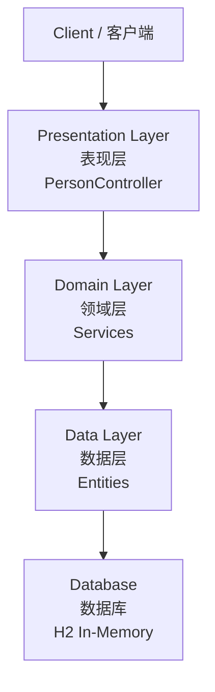

# Persons Finder - Developer Documentation

## 📖 Overview / 概述

Persons Finder is a Spring Boot REST API application designed to manage person location information and find nearby people. The application provides APIs for creating persons, updating their locations, and querying people within a specified radius.

Persons Finder 是一个 Spring Boot REST API 应用，用于管理人员位置信息并查找附近的人。该应用提供了创建人员、更新位置和查询指定半径内人员的 API。

## 🏗️ Architecture / 架构

### Application Architecture / 应用架构

The application follows a clean architecture pattern with clear separation of concerns:

```
src/main/kotlin/com/persons/finder/
├── ApplicationStarter.kt           # Application entry point / 应用入口
├── data/                           # Data models / 数据模型
│   ├── Person.kt                   # Person entity / 人员实体
│   └── Location.kt                 # Location entity / 位置实体
├── domain/                         # Business logic / 业务逻辑
│   └── services/                   # Service interfaces and implementations
│       ├── PersonsService.kt       # Person service interface
│       ├── PersonsServiceImpl.kt   # Person service implementation
│       ├── LocationsService.kt     # Location service interface
│       └── LocationsServiceImpl.kt # Location service implementation
└── presentation/                   # API layer / API 层
    └── PersonController.kt         # REST controller / REST 控制器
```

### Layered Architecture / 分层架构



**Layer Responsibilities / 层级职责:**

1. **Presentation Layer (表现层)**
   - REST API endpoints / REST API 端点
   - Request/Response handling / 请求/响应处理
   - Input validation / 输入验证

2. **Domain Layer (领域层)**
   - Business logic / 业务逻辑
   - Service interfaces and implementations / 服务接口和实现
   - Location calculation algorithms / 位置计算算法

3. **Data Layer (数据层)**
   - Data models / 数据模型
   - Database entities / 数据库实体
   - Data persistence / 数据持久化

## 🛠️ Technology Stack / 技术栈

### Core Technologies / 核心技术

| Technology | Version | Purpose | 用途 |
|------------|---------|---------|------|
| **Kotlin** | 1.6.21 | Programming language | 编程语言 |
| **Spring Boot** | 2.7.0 | Application framework | 应用框架 |
| **Spring Web** | - | REST API support | REST API 支持 |
| **Spring Data JPA** | - | Data persistence | 数据持久化 |
| **H2 Database** | 2.1.212 | In-memory database | 内存数据库 |
| **Gradle** | - | Build tool | 构建工具 |
| **JDK** | 11 | Java runtime | Java 运行时 |

### Key Dependencies / 关键依赖

```kotlin
dependencies {
    // Spring Boot Starter
    implementation("org.springframework.boot:spring-boot-starter")
    
    // Web support for REST APIs
    implementation("org.springframework.boot:spring-boot-starter-web")
    
    // JPA for database operations
    implementation("org.springframework.boot:spring-boot-starter-data-jpa")
    
    // H2 in-memory database
    implementation("com.h2database:h2:2.1.212")
    
    // Kotlin support
    implementation("org.jetbrains.kotlin:kotlin-reflect")
    
    // Testing
    testImplementation("org.springframework.boot:spring-boot-starter-test")
}
```

## 📊 Data Models / 数据模型

### Person Entity / 人员实体

```kotlin
data class Person(
    val id: Long,        // Unique identifier / 唯一标识符
    val name: String     // Person's name / 人员姓名
)
```

**Fields / 字段:**
- `id`: Unique identifier for the person / 人员的唯一标识符
- `name`: Full name of the person / 人员的全名

### Location Entity / 位置实体

```kotlin
data class Location(
    val referenceId: Long,  // Person's ID / 人员 ID
    val latitude: Double,   // Latitude coordinate / 纬度坐标
    val longitude: Double   // Longitude coordinate / 经度坐标
)
```

**Fields / 字段:**
- `referenceId`: References the person's ID / 关联人员的 ID
- `latitude`: Geographic latitude (-90 to 90) / 地理纬度（-90 到 90）
- `longitude`: Geographic longitude (-180 to 180) / 地理经度（-180 到 180）

## 🔌 API Endpoints / API 端点

### Planned Endpoints / 计划中的端点

The following REST API endpoints are planned for implementation:

#### 1. Create Person / 创建人员

```http
POST /api/v1/persons
Content-Type: application/json

{
  "name": "John Doe"
}
```

**Response / 响应:**
```json
{
  "id": 1,
  "name": "John Doe"
}
```

#### 2. Update Person Location / 更新人员位置

```http
PUT /api/v1/persons/{id}/location
Content-Type: application/json

{
  "latitude": 40.7128,
  "longitude": -74.0060
}
```

**Response / 响应:**
```json
{
  "referenceId": 1,
  "latitude": 40.7128,
  "longitude": -74.0060
}
```

#### 3. Find Nearby People / 查找附近的人

```http
GET /api/v1/persons/{id}/nearby?radius=10
```

**Query Parameters / 查询参数:**
- `radius`: Search radius in kilometers / 搜索半径（公里）

**Response / 响应:**
```json
{
  "personIds": [2, 5, 8, 12]
}
```

#### 4. Get Person Details / 获取人员详情

```http
GET /api/v1/persons?ids=1,2,3
```

**Query Parameters / 查询参数:**
- `ids`: Comma-separated list of person IDs / 逗号分隔的人员 ID 列表

**Response / 响应:**
```json
[
  {
    "id": 1,
    "name": "John Doe"
  },
  {
    "id": 2,
    "name": "Jane Smith"
  }
]
```

## 🚀 Getting Started / 快速开始

### Prerequisites / 前置条件

- **JDK 11** or higher / JDK 11 或更高版本
- **Gradle** (or use the included wrapper) / Gradle（或使用内置的 wrapper）
- **Git** for version control / Git 用于版本控制

### Installation / 安装

1. **Clone the repository / 克隆仓库**

```bash
git clone <repository-url>
cd persons-finder-devops
```

2. **Build the application / 构建应用**

```bash
# Using Gradle wrapper (recommended)
./gradlew build

# Or using installed Gradle
gradle build
```

3. **Run tests / 运行测试**

```bash
./gradlew test
```

### Running the Application / 运行应用

#### Option 1: Using Gradle / 使用 Gradle

```bash
./gradlew bootRun
```

#### Option 2: Using JAR file / 使用 JAR 文件

```bash
# Build the JAR
./gradlew build

# Run the JAR
java -jar build/libs/persons-finder-0.0.1-SNAPSHOT.jar
```

#### Option 3: Using Docker / 使用 Docker

```bash
# Build the Docker image
docker build -t persons-finder:latest -f devops/docker/Dockerfile .

# Run the container
docker run -p 8080:8080 persons-finder:latest
```

### Accessing the Application / 访问应用

Once the application is running, you can access it at:

应用启动后，可以通过以下地址访问：

- **Base URL**: `http://localhost:8080`
- **API Base**: `http://localhost:8080/api/v1`
- **Health Check**: `http://localhost:8080/actuator/health` (when Actuator is enabled)

### Testing the API / 测试 API

```bash
# Test the example endpoint
curl http://localhost:8080/api/v1/persons

# Expected response: "Hello Example"
```

## 🔧 Configuration / 配置

### Application Properties / 应用配置

The application configuration is located in `src/main/resources/application.properties`:

```properties
# H2 Database Configuration / H2 数据库配置
spring.datasource.url=jdbc:h2:mem:testdb
spring.datasource.driverClassName=org.h2.Driver
spring.datasource.username=sa
spring.datasource.password=password
spring.jpa.database-platform=org.hibernate.dialect.H2Dialect
```

### Environment Variables / 环境变量

The following environment variables can be configured:

| Variable | Description | Default | Required |
|----------|-------------|---------|----------|
| `OPENAI_API_KEY` | OpenAI API key for LLM integration | - | Yes (in production) |
| `SERVER_PORT` | Application server port | 8080 | No |
| `SPRING_PROFILES_ACTIVE` | Active Spring profile | default | No |

### Profiles / 配置文件

The application supports different profiles for different environments:

- **default**: Development profile with H2 in-memory database
- **dev**: Development environment configuration
- **prod**: Production environment configuration

Activate a profile:

```bash
# Using Gradle
./gradlew bootRun --args='--spring.profiles.active=dev'

# Using JAR
java -jar app.jar --spring.profiles.active=prod

# Using environment variable
export SPRING_PROFILES_ACTIVE=prod
java -jar app.jar
```

## 🧪 Testing / 测试

### Running Tests / 运行测试

```bash
# Run all tests
./gradlew test

# Run tests with coverage
./gradlew test jacocoTestReport

# Run specific test class
./gradlew test --tests "PersonControllerTest"
```

### Test Structure / 测试结构

```
src/test/kotlin/com/persons/finder/
└── DemoApplicationTests.kt    # Basic application context test
```

### Writing Tests / 编写测试

Example test structure:

```kotlin
@SpringBootTest
class PersonServiceTest {
    
    @Autowired
    lateinit var personService: PersonsService
    
    @Test
    fun `should create person successfully`() {
        val person = Person(id = 1, name = "Test User")
        personService.save(person)
        
        val retrieved = personService.getById(1)
        assertEquals("Test User", retrieved.name)
    }
}
```

## 🏗️ Development Workflow / 开发工作流

### 1. Feature Development / 功能开发

```bash
# Create a feature branch
git checkout -b feature/add-nearby-search

# Make changes
# ... edit code ...

# Run tests
./gradlew test

# Commit changes
git add .
git commit -m "feat: add nearby person search API"

# Push to remote
git push origin feature/add-nearby-search
```

### 2. Code Style / 代码风格

The project follows Kotlin coding conventions:

- Use camelCase for variables and functions
- Use PascalCase for classes
- Use meaningful names
- Add KDoc comments for public APIs
- Keep functions small and focused

### 3. Git Commit Messages / Git 提交信息

Follow conventional commits format:

```
<type>(<scope>): <subject>

<body>

<footer>
```

**Types:**
- `feat`: New feature
- `fix`: Bug fix
- `docs`: Documentation changes
- `style`: Code style changes
- `refactor`: Code refactoring
- `test`: Adding tests
- `chore`: Build process or auxiliary tool changes

**Example:**
```
feat(api): add nearby person search endpoint

Implement GET /api/v1/persons/{id}/nearby endpoint
with radius query parameter for finding people
within specified distance.

Closes #123
```

## 🐛 Debugging / 调试

### Enable Debug Logging / 启用调试日志

Add to `application.properties`:

```properties
logging.level.root=INFO
logging.level.com.persons.finder=DEBUG
logging.level.org.springframework.web=DEBUG
```

### Remote Debugging / 远程调试

```bash
# Run with debug enabled
./gradlew bootRun --debug-jvm

# Or with JAR
java -agentlib:jdwp=transport=dt_socket,server=y,suspend=n,address=5005 -jar app.jar
```

Connect your IDE debugger to `localhost:5005`.

### H2 Console / H2 控制台

Enable H2 console for database inspection:

```properties
spring.h2.console.enabled=true
spring.h2.console.path=/h2-console
```

Access at: `http://localhost:8080/h2-console`

## 📦 Building for Production / 生产构建

### Create Production JAR / 创建生产 JAR

```bash
# Build with production profile
./gradlew clean build -Pprod

# The JAR will be in build/libs/
ls -lh build/libs/persons-finder-0.0.1-SNAPSHOT.jar
```

### Docker Build / Docker 构建

```bash
# Build Docker image
docker build -t persons-finder:1.0.0 -f devops/docker/Dockerfile .

# Tag for registry
docker tag persons-finder:1.0.0 <registry>/persons-finder:1.0.0

# Push to registry
docker push <registry>/persons-finder:1.0.0
```

## 🔐 Security Considerations / 安全考虑

### API Key Management / API 密钥管理

- **Never** commit API keys to Git
- Use environment variables for sensitive data
- In Kubernetes, use Secrets
- Rotate keys regularly

### Input Validation / 输入验证

- Validate all user inputs
- Use Spring Validation annotations
- Sanitize data before processing
- Implement rate limiting

### PII Protection / PII 保护

- Implement PII redaction for external API calls
- Log only non-sensitive information
- Use encryption for data at rest
- Comply with GDPR/privacy regulations

## 📚 Additional Resources / 其他资源

### Documentation / 文档

- [Spring Boot Documentation](https://docs.spring.io/spring-boot/docs/current/reference/html/)
- [Kotlin Documentation](https://kotlinlang.org/docs/home.html)
- [Spring Data JPA](https://docs.spring.io/spring-data/jpa/docs/current/reference/html/)

### DevOps Documentation / DevOps 文档

- [Deployment Guide](../devops/docs/DEPLOYMENT.md)
- [Quick Start Guide](../devops/docs/QUICKSTART.md)
- [GitHub OIDC Setup](../devops/docs/GITHUB-OIDC-SETUP.md)
- [Secrets Management](../devops/docs/SECRETS-MANAGEMENT.md)

### Project Structure / 项目结构

```
persons-finder-devops/
├── src/                        # Source code / 源代码
│   ├── main/
│   │   ├── kotlin/            # Kotlin source files
│   │   └── resources/         # Configuration files
│   └── test/                  # Test files / 测试文件
├── devops/                    # DevOps configurations / DevOps 配置
│   ├── docker/               # Docker files
│   ├── helm/                 # Helm charts
│   ├── terraform/            # Infrastructure as code
│   ├── scripts/              # Deployment scripts
│   └── docs/                 # DevOps documentation
├── docs/                      # Application documentation / 应用文档
│   └── DEVELOPER.md          # This file / 本文件
├── build.gradle.kts          # Gradle build configuration
├── settings.gradle.kts       # Gradle settings
├── gradlew                   # Gradle wrapper (Unix)
├── gradlew.bat              # Gradle wrapper (Windows)
└── README.md                # Project overview / 项目概述
```

## 🤝 Contributing / 贡献

### How to Contribute / 如何贡献

1. Fork the repository
2. Create a feature branch
3. Make your changes
4. Write/update tests
5. Ensure all tests pass
6. Submit a pull request

### Code Review Process / 代码审查流程

1. Automated CI checks must pass
2. At least one approval required
3. No merge conflicts
4. Documentation updated if needed

## 📞 Support / 支持

For questions or issues:

- Create an issue in the repository
- Contact the development team
- Check the documentation

## 📄 License / 许可证

This project is part of a DevOps challenge and is for educational purposes.

---

**Happy Coding! / 编码愉快！** 🚀
